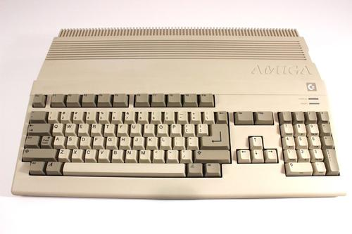
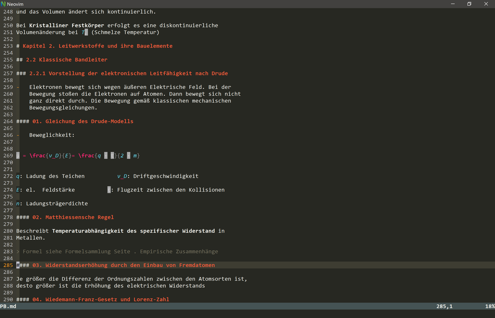
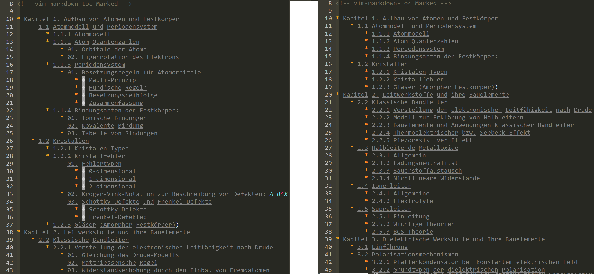
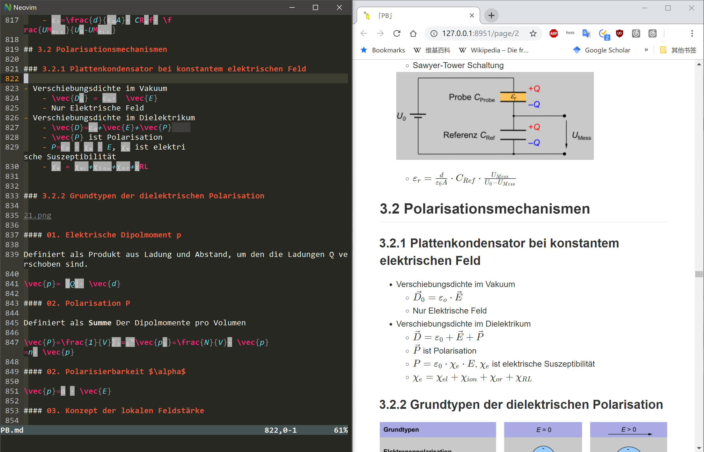
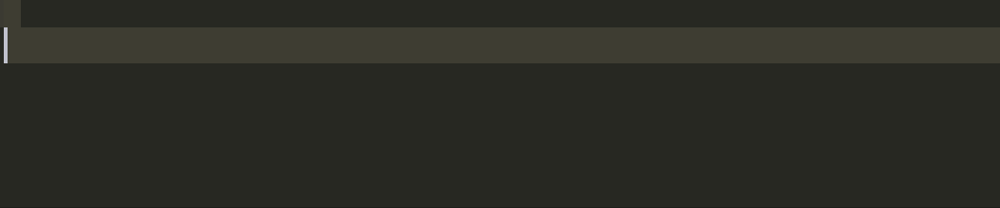
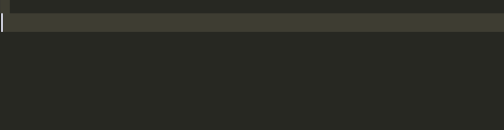
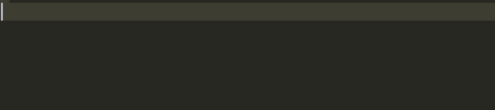
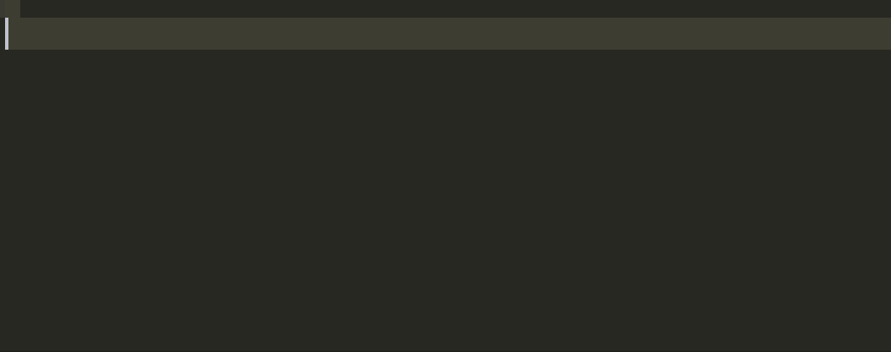

高效做笔记:vim + markdown
------

<center>
    
    <div style="
    display: outline;
    color: #666;
    padding: 2px;">NERV 镇楼 </div>
</center>


作为一个在校大学生, 我常常苦恼于如何有效记笔记一事。理想状态的笔记方式应当保证录入准确快速，整理总结时不额外浪费时间，可电子化，事后查找方便。

曾经一度使用纸笔记录，发现效率不高且难以寻找知识点。在学习完一门课之后总会留下大堆笔记，导致下次再想复习曾经学过的知识点时难以寻找，费时费力。而且课程与课程之间存在关联，在总结复习时，总是需要把大堆的笔记和书本摊开，整个桌面十分混乱不说，还容易错漏。
因此将笔记电子化成为一大刚需。而如果使用word或者其他文字编辑软件，又难以正确打出数学公式和图表。
于是我便考虑使用Surface。记录手写电子笔记。
Surface Pro结合Oneno基本可以满足手写笔记，数学公式的记录也基本可以满足。**然而**还是存在笔记难以被搜索到，格式不规范的问题。
复习时往往需要花更多的时间重新整理笔记，额外花费更多时间。
这个时候，[这篇文章](https://castel.dev/post/lecture-notes-1/) 出现在了我的视野。
作者使用vim+Latex的方式， 实现了速记带数学公式的笔记的目的，给了我很大启发。于是乎，通过不断地尝试，我也逐步摸索出使用vim+Markdown记笔记的方法。

# Why Markdown

Markdown 是一种轻量级的标记语言，由John Gruber和Aaron Swartz创建，使其成为可读性最大并可再发行的可输入输出的格式。这种语言创建灵感来自于已经存在的带标记的电子邮件文本。Markdown 允许 HTML 语法, 所以使用者如果需要可以直接用 HTML来表示是可以的。

使用Markdown可以方便快速且专注地处理文字，不受格式，版式的干扰。与Latex不同之处在于，Markdown简洁的语法，容易上手的特性以及对于Latex和html的兼容性。使用Markdown时，可以简单的使用关键词 “\$\$” 或者一对 “\$\$” 插入Latex语法的数学公式。比如：

```Latex
$$
-(\frac{\hbar^2}{2m}) \cdot  \frac{\delta \Phi ^2}{\delta x^2}+ V \Phi 
= i\hbar \frac{\delta \Phi}{\delta t}
$$
```
$$
-(\frac{\hbar^2}{2m}) \cdot  \frac{\delta \Phi ^2}{\delta x^2}+ V \Phi = i\hbar \frac{\delta \Phi}{\delta t}
$$
除此以外，Markdown还支持html语法。在Markdown中，可以使用诸如
```html
<div class="solid">
&emsp;This is a Box

&emsp;Math: 
$$
\int_{-\infty}^{\infty} \frac{1}{x^2}dx
$$

</div>
```
<div class="solid">
&emsp;This is a Box

&emsp;Math: 
$$
\int_{-\infty}^{\infty} \frac{1}{x^2}dx
$$

</div>

的方式加入一些我们所需要的元素。因此我认为，在大部分情况下，使用Markdown做笔记足矣。


# Why Vim or Neovim

[Vim](https://www.vim.org/) 是从 vi 发展出来的一个文本编辑器。代码补全、编译及错误跳转等方便编程的功能特别丰富，在程序员中被广泛使用，和Emacs并列成为类Unix系统用户最喜欢的文本编辑器。由于Vi设计之初，鼠标还非电脑标配，控制台与格式命令还是当时操控电脑的唯一方式，因此造就了Vi独特的使用方式。而Vim诞生之初是面向Amiga这一系列电脑的vi移植，随后才移植回Unix。大家可以看下Amiga最初的键盘设计：
<center>
    
    <div style="
    display: outline;
    color: #666;
    padding: 2px;">Amiga 键盘 </div>
</center>

vim的设计理念是命令的组合。用户学习了各种各样的文本间移动/跳转的命令和其他的普通模式的编辑命令，并且能够灵活组合使用的话，能够比那些没有模式的编辑器更加高效的进行文本编辑。通过安装各类插件，vim可以实现从码字到撸代码各种不同的需求。同时用户可以自定义快捷键，自定义方程，自定义命令。。。强大的自定义编辑使得Vim可被用户随意揉捏，打造自己独特的编辑器。

[Neovim](https://neovim.io) 是Vim的重构版本，是Vim在这个时代的重生。其完美继承了Vim的操作方式。由于Vim本身开发时间较早，代码维护困难，使得bug的修复愈发困难。当时Neovim的作者曾向Vim提交过两大补丁，包含大量改动，不幸被Vim的作者拒绝，理由是风险太大。因此Neovim的作者干脆另起炉灶，发布了Neovim。Neovim相比Vim有很多优秀的改动与变化。例如多线程（Vim 8.0 之后也有了），悬浮窗口，支持任何语言编写插件等等。。。当然，对于普通的使用者来说，我是察觉不出两者区别有多大的。但是由于某几个插件的特殊性（Markdown Perview），我最终还是选择了Neovim作为我的主力编辑器。

接下来我将详细介绍Vim+Markdown的详细配置。

# Vim 配置文件：vimrc/ init.vim (Neovim)


如前文所提，vim可以通过配置文件自定义插件，快捷键和命令。如果使用的是Vim，可以在vim的安装文件夹中查看有没有名为 **vimrc**的文件。若没有可以在vim中使用
```vim
:vi vimrc
```
来新建vim配置文件。如果使用的是Neovim，则可以新建 **init.vim** 作为Neovim的配置文件。具体方法请参考 [Vim 官网](https://www.vim.org) 和 [Neovim 官网](https://www.neovim.io) 以及其他教程。  


## 插件管理器：vim-plug

Vim—plug ([Github](https://github.com/junegunn/vim-plug))是一个适用于vim或者Neovim的插件管理器。具有安装简单，使用简单，多线程平行安装，支持Branch/Tag/Commit等等功能。将Vim-plug下载下来后，把文件***plug.vim*** 复制粘贴到**vim**安装路径下的**vimfiles/autoload/** 下面或者**Neovim**安装路径下的**share/nvim/runtime/autoload**下面即可。

vim-plug安装成功后就可以在**vimrc**或者**init.vim**中安装插件了。

```vim
call plug#begin('~/.vim/plugged') "Vim 插件的安装路径，可以自定义。
"~ 表示系统路径，在windows下为 C:/User/username/

Plug 'path/of-plugin'
Plug '...'
"将所有插件安装在这里

call plug#end()
```
配置完成后，重启vim。在命令模式下输入

```vim
:PlugInstall
```
就可以自动安装所有插件了。

## Markdown 插件

### 1. vim-markdown

[vim-markdown](https://github.com/plasticboy/vim-markdown) 是一个Markdown语法高亮插件。其提供了针对Markdown的语法高亮，段落折叠，查看目录，段间跳转等功能，相当好用。


#### 安装与命令

```vim
"安装插件
Plug 'godlygeek/tabular' "必要插件，安装在vim-markdown前面
Plug 'plasticboy/vim-markdown'
"查看所有配置建议
:help vim-markdwon
[[ "跳转上一个标题
]] "跳转下一个标题
]c "跳转到当前标题
]u "跳转到副标题
zr "打开下一级折叠
zR "打开所有折叠
zm "折叠当前段落
zM "折叠所有段落
:Toc "显示目录
```
由于我们还会使用到Latex数学公式，所以可以在配置文件中加上

```vim
let g:vim_markdown_math = 1
```
来高亮数学公式。


### 2. vim-markdown-toc

[vim-markdown-toc](https://github.com/mzlogin/vim-markdown-toc) 是一个自动在当前光标生成目录的插件。 

#### 安装与命令

```vim
"安装插件
Plug 'mzlogin/vim-markdown-toc'
"在当前光标后生成目录
:GenTocMarked
"更新目录
:UpdateToc
"取消储存时自动更新目录
let g:vmt_auto_update_on_save = 0
```
由于自动生成的目录层级太多，因此我在配置文件中写了一个方程，自动找到较低的目录层级，然后删除之：

```vim
function RToc()
    exe "/-toc .* -->"
    let lstart=line('.')
    exe "/-toc -->"
    let lnum=line('.')
    execute lstart.",".lnum."g/           /d"
endfunction
```

效果大概如下：
<center>
    
    <div style="
    display: outline;
    color: #666;
    padding: 2px;">左：自动生成的目录 &emsp; &emsp; &emsp; &emsp; &emsp; &emsp;右：删除较低层级后 </div>
</center>


### 3. markdown-preview.vim/ markdown-preview.vim

[markdonw-preview.nvim](https://github.com/iamcco/markdown-preview.nvim)（Neovim）和 [markdown-preview.vim](https://github.com/iamcco/markdown-preview.vim) (Vim) 可以通过浏览器实时预览Markdown 文件。并可以借助浏览器的打印功能导出PDF文档。两个插件为同一个作者的作品，但是Neovim版本较新，更加完善，附带了Latex预览，Mermaid甘特图，Plantuml UML图等等一系列功能。Vim版本较旧，且已不再维护。所以我推荐大家使用Neovim而非Vim。
        
    注：如果使用Vim并且想预览数学公式，还需要安装 mathjax-support-for-mkdp。
    详情见 github.com/iamcco/markdown-preview.vim 

#### 安装与命令

```vim
" 安装插件
Plug 'iamcco/markdown-preview.nvim'
" 打开/关闭预览
:MarkdownPreviewToggel
" 指定浏览器路径
let g:mkdp_path_to_chrome = "path/of/chrome"
" 指定预览主题，默认Github
let g:mkdp_markdown_css=''
```
<center>
    
    <div style="
    display: outline;
    color: #666;
    padding: 2px;">Markdown 预览效果 </div>
</center>


## Ultisnips 片段

[ultisnips](https://github.com/SirVer/ultisnips) 是一个非常实用的Vim插件。**Snippets**译为片段，在这里表示可被某一段关键词触发并替换的一段短小的，可重复利用的文本块。比如我输入 **title** 然后按 **Tab**键，那么就会出现如下图：

<center>
    
    <div style="
    display: outline;
    color: #666;
    padding: 2px;">snippet 例子 </div>
</center>
Ultisnips还支持嵌套使用，例如：


```
注意！！！：ultisnips 需要python支持。

1. 如果使用的是vim，则需要在电脑安装相同编码，指定版本的python。
如果Vim是32位的，那么一定安装32位的python，否则vim无法识别。

2. 如果使用的是Neovim，那么只要确保安装了python，然后在控制台使用

>> pip install neovim

就可以使用了。
```

### ultisnippet 安装与命令

```vim
"安装插件
Plug 'SirVer/ultisnips'

"设置tab键为触发键
let g:UltiSnipsExpandTrigger = '<tab>'
"设置向后跳转键
let g:UltiSnipsJumpForwardTrigger = '<tab>' 
"设置向前跳转键
let g:UltiSnipsJumpBackwardTrigger = '<S-tab>' 
"设置文件目录
let g:UltiSnipsSnippetDirectories=["path/of/snippetDirectories"]
"设置打开配置文件时为垂直打开
let g:UltiSnipsEditSplit="vertical" 
```

### .snippets 文件

在使用 ***vim-plug*** 安装完 ***ultisnips*** 之后，可以在插件安装路径下找到文件夹 **ultisnips**。在该文件夹下新建一个 **.snippets** 的文本文件 （例如 ***markdown.snippets***），就可以在文件里面自定义片段了。

一个片段的格式一般为：

```snippets
snippet triggerWord "Comment" iAwrb
your snippets
endsnippet
```

其中 **triggerWord** 为关键词，**your snippets** 为自动输出的文本片段。

**iAwrb** 为snippet的选项。
- ***i*** 表示片段可在句中被触发。默认是只有在前面有多个空格或者在行首时才会被触发。
- ***A*** 表示片段会被自动触发
- ***w*** 表示片段只会在关键词为单独单词的情况下被触发。若关键词为 **mk**, 那么只有在 **html mk** 时会被触发，**htmlmk** 不会被触发。
- ***r*** 表示关键词使用正则表达式。正则表达式必须用 两个引号\' \'包围。比如 ***\'([1-9])day\'***。
- ***b*** 表示只有在一行的开头才会被触发。

#### Python 支持

使用 ***ultisnips*** 时最为方便的就是可以在片段中加入python脚本。用 \`!p \` 包围脚本，并使用 ***snip.rv=\'\'*** 返回计算结果。加入了python可以使得输入更加智能便捷，并实现一些骚操作。例如

```snippets
# 在数学模式下自动加下标
context "math()"
snippet '([A-Za-z])(\d)' "auto subscript" wrA
`!p snip.rv = match.group(1)`_`!p snip.rv = match.group(2)`
endsnippet
```

<center>
    
    <div style="
    display: outline;
    color: #666;
    padding: 2px;">自动加下标 </div>
</center>


或者

```snippets
# 根据用户输入新建一个Markdown格式的表格
snippet '(?<!\\)([0-9])([0-9])tb' "new table" r
$1`!p 
x=match.group(1)
y=match.group(2)
row1=""
row2="" 
for i in range(int(x)):
	row1+="| "
	row2+="|:-:"
row1+="|\n"
row2+="|\n"
out=row1+row2+int(y)*row1
snip.rv=out
`$0
endsnippet
```
<center>
    
    <div style="
    display: outline;
    color: #666;
    padding: 2px;">生成4x4（不算表头）的表格 </div>
</center>

#### Latex数学公式

##### $\clubsuit$ Inline & Display

在Markdown中，Latex数学公式可分为 inline 模式和 Display 模式。inline 模式关键词为 \$\$, Display 模式关键词为一对\$\$。因此，沿袭 [Gilles Castel](https://castel.dev/) 大佬的习惯，有如下snippets：

```snippets
# mk 表示 make Ketax
snippet mk "Math" wA
$${1}$`!p
if t[2] and t[2][0] not in [',', '.', '?', '-', ' ']:
	snip.rv = ' '
else:
	snip.rv = ''
`$2
endsnippet

# dm 表示 Display math
snippet dm "Math" wA
$$
${1:${VISUAL}}
$$ $0
endsnippet
```

<center>
    
</center>

##### $\clubsuit$ 分数，希腊字母

Latex语法下的分数为 **\\frac{}{}** , 输入较为费劲。使用 snippets 能使这个过程简便很多。使用正则表达式与python可以很好的识别出是否为数字，是否被括号包裹等等。类似的应用还有诸如希腊字母的快速输入，快速输入上下标，快速输入积分、级数等等。例如：

```snippets
# 若输入 ‘/’，则检查符号前的字符是否为数字或者字母，
# 将数字或字母作为分子扩展为Latex分数形式然后在分母部分等待输入
context "math()"
priority 1000
snippet '((\d+)|(\d*)(\\)?([A-Za-z]+)((\^|_)(\{\d+\}|\d))*)/' "Fraction" wrA
\\frac{`!p snip.rv = match.group(1)`}{$1}$0
endsnippet

```


<center>
    
    <div style="
    display: outline;
    color: #666;
    padding: 2px;"> </div>
</center>

--------

--------

熟练使用Ultisnips可以大大加快输入速度，在输入Latex时可以缩减输入时间，让人更加专注于数学公式，而不是去思考Latex这个语言。

更多的Snippet代码 [请看这里](https://github.com/cold-soda-jay/Markdown-vim)。 

## 其它插件

1. [vim-auto-save](https://github.com/907th/vim-auto-save): 自动保存插件
2. [nerdtree](https://github.com/scrooloose/nerdtree)：文件查看器
3. [vim-startify](https://github.com/mhinz/vim-startify)：Vim欢迎页修改

这三个插件我就不一一介绍了。感兴趣的朋友可以自己上网查看。

另外，推荐一个制作字符画的网站：[GlassGiant.com](http://glassgiant.com/ascii/)。可以设置大小，字符数等等。。只需要把图片上传就行。

<center>
    
    <div style="
    display: outline;
    color: #666;
    padding: 2px;">使用GlassGiant网站生成的字符画结合Startify设置出的欢迎界面 </div>
</center>


# 附：使用到的插件清单（Neovim）

```vim
"General{{{
Plug '907th/vim-auto-save'
Plug 'scrooloose/nerdtree'
Plug 'mhinz/vim-startify'
"}}}
"
"Markdown{{{
Plug 'godlygeek/tabular'
Plug 'SirVer/ultisnips',{'for':'markdown'}
Plug 'mzlogin/vim-markdown-toc'
Plug 'plasticboy/vim-markdown'
Plug 'iamcco/markdown-preview.nvim'
"}}}
```

**vimrc** 配置文件和 **snippet** 代码 都可以在我的 [Github](https://github.com/cold-soda-jay/Markdown-vim)。

-----

第一次在知乎发文章，有任何错漏欢迎告知，一定改正。有任何问题欢迎私信，谢谢大家~

